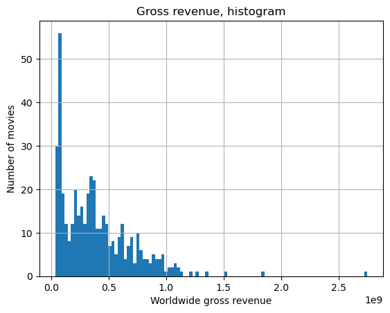
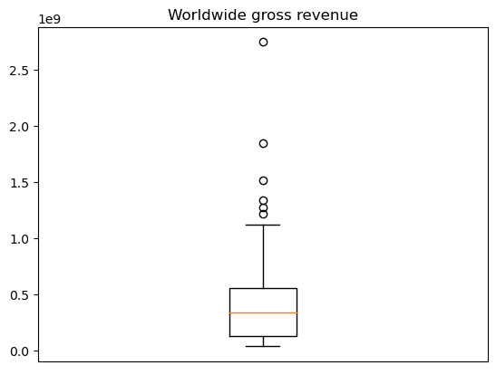
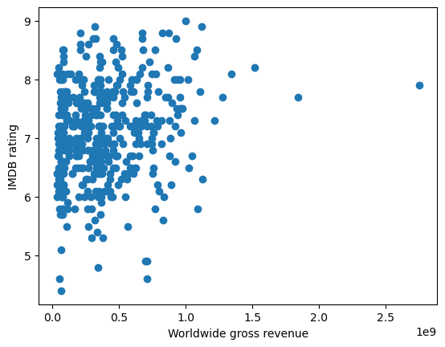
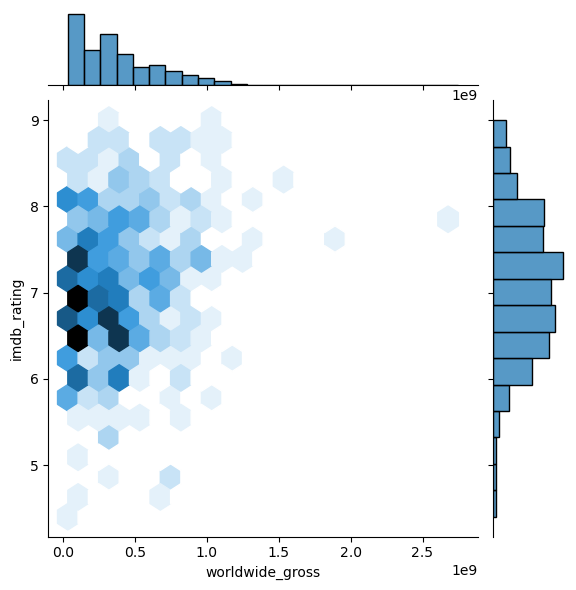
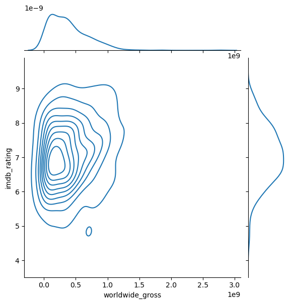
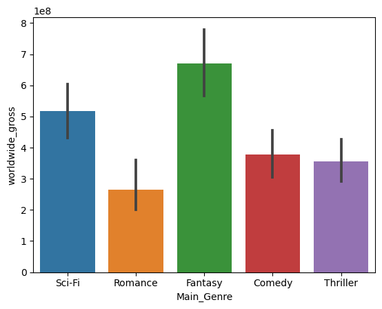
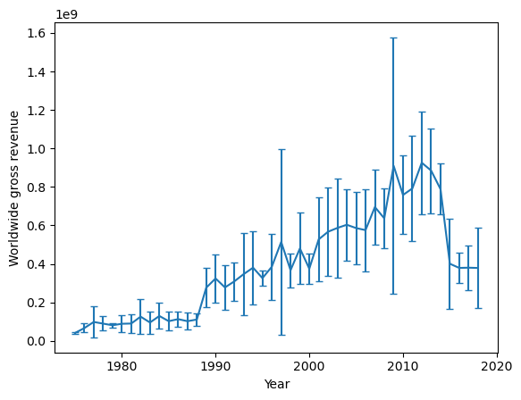
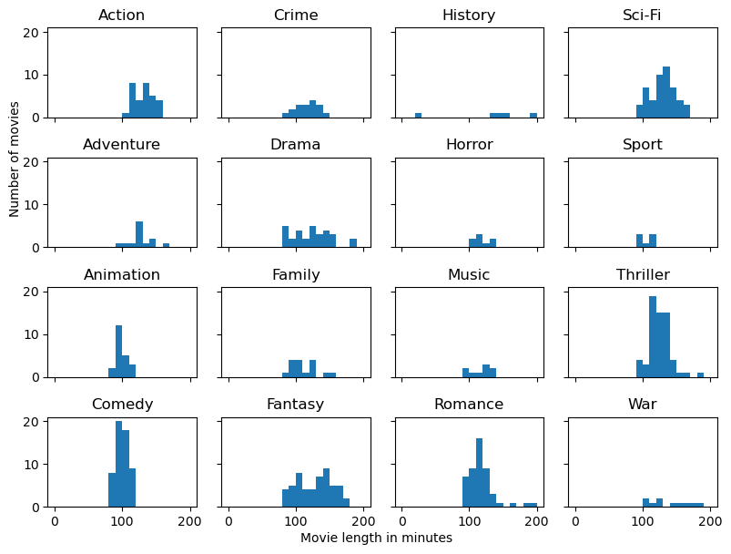
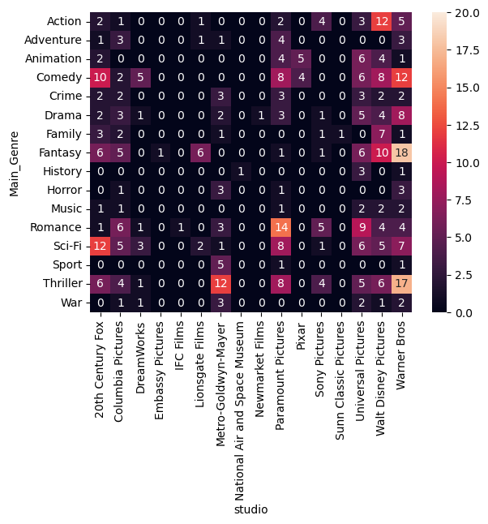
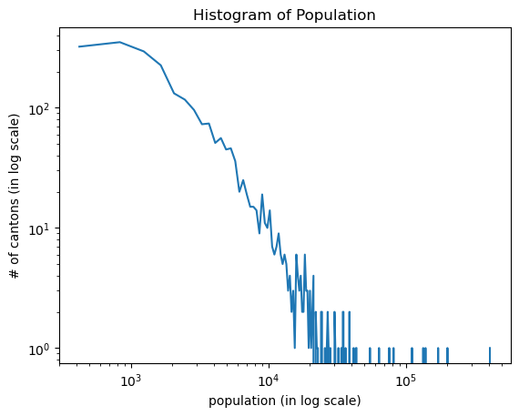

# Data vizualization

## Generalities
```python
plt.xlabel('x label')
plt.title('title')
plt.xticks([]) # Remove xticks
plt.show()
```

## Single variable

### Histogram



```python
df['column'].hist(bins=10, log=False) #log=True for a log scale (for skewed distributions)
```
Can set `histtype='step'` to have a line instead of bars.
```python
plt.boxplot(df['column'])
```

### Boxplot



```python
plt.boxplot(df['column'])

df.boxplot(columns=['column'], by='column2') # Using by allow to do a boxplot for each unique value of column2
```

## 2 continuous variables

### Scatter plot



```python
plt.scatter(df['column1'], df['column2'], s=10) # s is the size of the dots
```

### Joint plot


With kind='hex'



With kind='kde'



```python
import seaborn as sns
sns.jointplot(x=df['column1'], y=df['column2'], kind='hex') # kind can be 'scatter', 'reg', 'resid', 'kde', 'hex', 'hist'
```
Different types:
- hex & kde: cf upper plots
- scatter: cf scatter plot
- reg: scatter with a regression line
- resid: scatter with a regression line and the residuals (Never used)
- hist: cf histogram

## 2 variables: continuous and categorical
### Barplot



```python
sns.barplot(x='column1', y='column2', data=df)
```

Can also use ***boxplot*** and ***violinplot***.

```python
sns.boxplot(x='column1', y='column2', data=df)
sns.violinplot(x='column1', y='column2', data=df)
```

## Visualizing uncertainty



```python
plt.errorbar(x, y, yerr=std, capsize=3) # capsize is the size of the cap of the error bar
```


```python
plt.fill_between(x, y - std, y + std, alpha=0.5) # alpha is the transparency of the fill
```

## Categorical panel



```python
df_cat = df.groupby(['column1']).appy(lamnda: x: pd.Series({'column2': x['column2'].values}))

fig, ax = plt.subplots(4, 4, figsize=(8,6), sharex=True, sharey=True)

for i in range(16):
    sbbplt = ax[i%4, i//4]
    sbplt.hist(df_cat.iloc[i].values, range = [X, Y], bins=500) # Define the range of the x axis to have the same scale for all plots
    sbplt.set_title(df_cat.index[i])
```

## 2 categorical variables
### Heatmap



```python
df_hm = pd.crosstab(df['column1'], df['column2'])
sns.heatmap(df_hm, annot=True, vmin=0, vmax=20) # vmin and vmax are the min and max values of the colorbar
```



```python
arr = plt.hist(df['column1'], bins=100, log=True)
plt.loglog(arr[1][1:], arr[0]) # arr[1] is the bins and arr[0] is the values
```

Can add `cumulative=-1` to have the cumulative distribution.