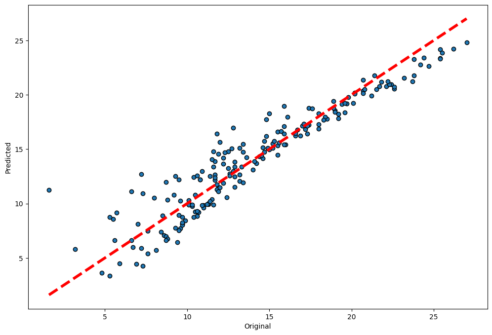

# Supervised Learning

## Linear Regression
```python
from sklearn.linear_model import LinearRegression
feature_col = ['col1', 'col2', 'col3']
X = df[feature_col]
y = df.colY
model = LinearRegression()
model.fit(X, y)

# Predict
y_pred = model.predict(X_new)

# Display the coefficient and intercept
for f in range(len(feature_cols)):
    print("{0} * {1} + ".format(model.coef_[f], feature_cols[f]))
print(model.intercept_)
```

### Cross validation and plotting predicted against original



```python
lr = LinearRegression()

# cross_val_predict returns an array of the same size as `y` where each entry
# is a prediction obtained by cross validation:
predicted = cross_val_predict(lr, X, y, cv=5)

# Plot the results
fig, ax = plt.subplots(figsize=(12, 8))
ax.scatter(y, predicted, edgecolors=(0, 0, 0))
ax.plot([min(y), max(y)], [min(y), max(y)], 'r--', lw=4)
ax.set_xlabel('Original')
ax.set_ylabel('Predicted')
plt.show()
```

### Regularization
Ridge regression is a linear regression with a penalty term that will penalize the large weights.
```python
from sklearn.linear_model import Ridge
ridge = Ridge(alpha=6) # alpha is the regularization strength
predicted = cross_val_predict(ridge, X, y, cv=5)
```

## Prepare a categorical feature
```python
# Create dummy variables for categorical feature
X = pd.get_dummies(df.col)
```

## Logistic Regression
```python
from sklearn.linear_model import LogisticRegression
logreg = LogisticRegression(solver='lbfgs') # solver is the optimization algorithm, default is lbfgs
logreg.fit(X, y)
```

### Plot the ROC curve
```python
# Predict the probabilities with a cross validationn
y_pred = cross_val_predict(logistic, X, y, cv=10, method="predict_proba")
# Compute the False Positive Rate and True Positive Rate
fpr, tpr, _ = roc_curve(y, y_pred[:, 1])
# Compute the area under the fpt-tpf curve
auc_score = auc(fpr, tpr)

# Plot the ROC curve
plt.plot(fpr, tpr)
plt.plot([0, 1], [0, 1],'r--')
plt.xlabel("False Positive Rate")
plt.ylabel("True Positive Rate")
plt.title("ROC Curve - Area = {:.5f}".format(auc_score))
```

## K-NN

```python
clf = KNeighborsClassifier(15) # 15 is the number of neighbors (K)
clf.fit(X_train, y_train)
```

### Plot the class of different area in the feature space
```python

# Plotting helper 
# Source: https://scikit-learn.org/stable/auto_examples/neighbors/plot_classification.html
from matplotlib.colors import ListedColormap

def plot_prediction(model, X, y, ax, K):
    # step size in the mesh
    h = .02
    # Create color maps
    cmap_light = ListedColormap(['orange', 'cyan', 'cornflowerblue'])
    cmap_bold = ListedColormap(['darkorange', 'c', 'darkblue'])

    x_min, x_max = X[:, 0].min() - 1, X[:, 0].max() + 1
    y_min, y_max = X[:, 1].min() - 1, X[:, 1].max() + 1
    xx, yy = np.meshgrid(np.arange(x_min, x_max, h),
                         np.arange(y_min, y_max, h))
    Z = model.predict(np.c_[xx.ravel(), yy.ravel()])

    # Put the result into a color plot
    Z = Z.reshape(xx.shape)
    ax.pcolormesh(xx, yy, Z, cmap=cmap_light, shading='auto')

    # Plot also the training points
    ax.scatter(X[:, 0], X[:, 1], c=y, cmap=cmap_bold,
                edgecolor='k', s=20)
    ax.set_xlim(xx.min(), xx.max())
    ax.set_ylim(yy.min(), yy.max())
    ax.set_title("K = {}".format(K))
```